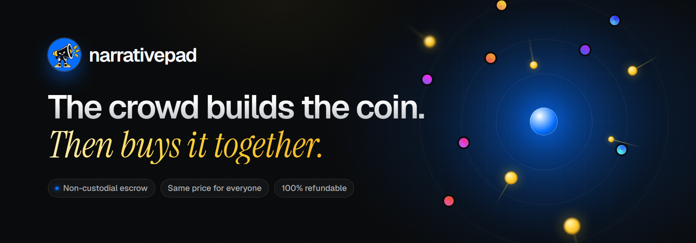
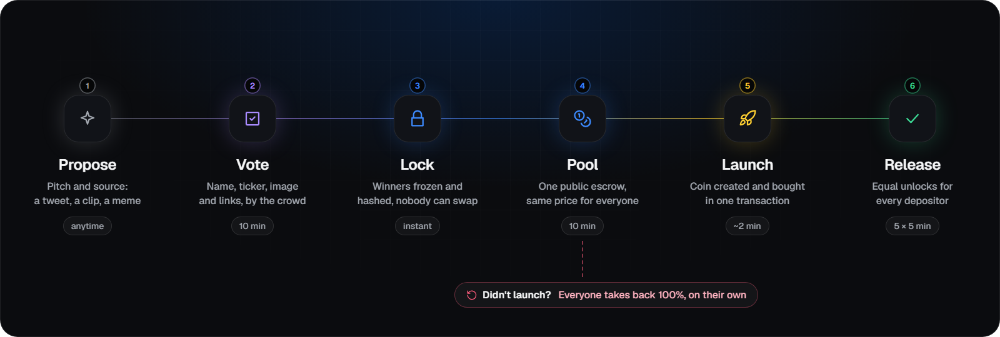
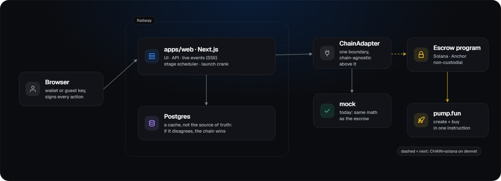

<div align="center">



<h3>The community memecoin launchpad.<br>The crowd designs the coin, then buys it together through one public, non-custodial escrow.</h3>

<p>
  <a href="https://web-production-776f2.up.railway.app"><b>Live preview</b></a>
  &nbsp;·&nbsp;
  <a href="docs/ARCHITECTURE.md"><b>Architecture</b></a>
  &nbsp;·&nbsp;
  <a href="DECISIONS.md"><b>Decision log</b></a>
  &nbsp;·&nbsp;
  <a href="https://x.com/narrativepad"><b>@narrativepad</b></a>
</p>

<p>
  <a href="https://github.com/narrativepad/narrativepad/actions/workflows/web.yml"></a>
  <a href="https://github.com/narrativepad/narrativepad/actions/workflows/program.yml"></a>
  
  <a href="https://explorer.solana.com/address/42bwRMxcnpbfiH1K68dGuVkgEWdZoWY72fZ7VVVcbVrY?cluster=devnet"></a>
  <a href="https://x.com/narrativepad"></a>
</p>

</div>

> [!WARNING]
> **Preview build.** The live site runs on a simulated chain, so no real SOL moves. The escrow program is written and tested in CI, but it is **not deployed and not audited**. Nothing here is on mainnet.

## Why narrativepad

When a good coin idea appears, snipers and copycats launch first, insiders bundle, and the community that made the narrative ends up as exit liquidity.

narrativepad flips that. **The crowd decides everything before the coin exists**: the name, ticker and image, and what it trades against (SOL, another coin, or a tokenized stock). Then everyone who wants in **buys at launch through one public escrow, at the same price**. The coin is created and bought in a single transaction, so nobody gets in ahead of the pool. If it doesn't launch, everyone takes back 100%.

## How it works



| Stage | What happens | Default |
|---|---|---|
| **Propose** | Anyone posts a pitch and its source: a tweet, a clip, a meme. | anytime |
| **Vote** | The crowd suggests and votes on name, ticker, image and pair (anything pump.fun accepts). One signed vote per person per field; ties go to the earliest entry. | 3 min |
| **Lock** | The winners are frozen, and a hash of the metadata is committed, so nobody (including us) can swap them. | instant |
| **Pool** | Deposits go into one public escrow, never to a wallet anyone controls. Per-wallet max and pool cap are enforced. Each deposit also votes pump.fun holder rewards on or off, weighted by its SOL. | 10 min |
| **Launch** | The escrow creates the coin and makes the opening buy with the whole pool, in the same transaction. | ~2 min later |
| **Release** | Tokens go back to every depositor pro-rata, unlocking in equal steps for everyone at once. | 5 × 5 min |

## What's guaranteed, and what isn't

| | How | Limit |
|---|---|---|
| **Non-custodial** | Funds only ever sit in the escrow program. No admin withdraw, no code path that moves user funds except refund, launch and claim. | Upgrade authority must be time-locked or renounced before mainnet. |
| **Same price for everyone** | Coin creation and the pool's buy happen in one instruction, so nothing can be inserted in between. | Anyone buying after the pool pays a higher price. |
| **Locked and verifiable** | The lock hash is recomputed in your browser from the served metadata, the winners and a Merkle root of every signed vote. | Copies can be launched elsewhere. The official coin is the one whose page shows this hash. |
| **Refunds can't be blocked** | Time-based pulls. If the pool misses its minimum or the launch deadline passes, every depositor withdraws 100% themselves. | Platform fee (1%, hard cap 2%) applies only on a successful launch. |

## Features

- **Crowd-built coins:** ballots for every field, wallet-signed votes, a live tally with percentages, and an image lightbox.
- **One public pool:** caps and order enforced, a live pool chart, the full depositor list, and a bonding-curve view of where the pool buys.
- **Live updates:** server-sent events, instant chat per coin with an "N here now" count, live alerts, a Trending tab, and animated numbers.
- **For holders:** a portfolio with claim-all and refund-all, a watchlist, share-to-X, and launch reminders.
- **Easy to start:** a guest identity that votes without a wallet, a `Ctrl K` command palette, and mobile-first layouts.
- **Transparent by default:** downloadable signed votes, in-browser hash verification, a public decision log, and moderation with reports.

## Architecture



- **The chain is the source of truth for money.** The database is a cache, and if they disagree, the chain wins.
- **One chain adapter boundary** (`apps/web/src/lib/chain`) keeps everything above it chain-agnostic. `CHAIN=mock` today; `CHAIN=solana` once the escrow is on devnet.
- **Shared math:** `apps/web/src/lib/math.ts` mirrors `programs/narrative_escrow/src/math.rs` exactly (BigInt, rounding down), so the UI shows the numbers the escrow will produce.

| Path | What's there |
|---|---|
| [`apps/web`](apps/web) | Next.js app: UI, API routes, SSE stream, stage scheduler, simulated chain. |
| [`programs/narrative_escrow`](programs/narrative_escrow) | Anchor escrow program: deposits, launch via pump.fun CPI, vesting claims, refunds. |
| [`tests/mock_pump`](tests/mock_pump) | **Test-only** pump.fun stand-in for LiteSVM. Never deployed. |
| [`idls`](idls) | Vendored pump.fun IDL that the program's encoding is checked against. |
| [`docs`](docs) | Brief, architecture and threat model, deploy notes. |
| [`DECISIONS.md`](DECISIONS.md) | Every non-trivial decision: what, why, alternatives, who decided. |

## Quick start

Requires Node 22. No database to install: locally the app uses embedded PGlite.

```bash
git clone https://github.com/narrativepad/narrativepad.git
cd narrativepad/apps/web
npm install
npm run dev            # http://localhost:3000
```

Fill a local database with narratives in every stage:

```bash
npm run build
node --experimental-strip-types scripts/demo-seed.ts
PGLITE_DIR=./.data/demo npx next start -p 3917
```

Configuration is environment variables only (names in [`apps/web/.env.example`](apps/web/.env.example)). Secrets never go in the repo.

## Testing

| Suite | What it covers | Run |
|---|---|---|
| Unit | Escrow math mirror: pro-rata, vesting, rounding, lock hash | `npm test` |
| API lifecycle | Create → vote → lock → pool → launch → claim, refunds, chat rules, signature tampering, replay, caps | `node --experimental-strip-types scripts/sim-e2e.ts <url>` |
| Browser | Every page and action as a guest, two-visitor live chat, phone layouts, console errors | `node scripts/ui-e2e.mjs <url> <outDir>` |
| Smoke | Read-only checks safe against production | `node scripts/smoke.mjs <url>` |
| Escrow program | Unit, property and LiteSVM tests: caps, ordering, refunds, launch failure, double-claim, dust, PDA and signer checks | CI, or `scripts/test-program.sh` in WSL2 |

All of these run in [GitHub Actions](.github/workflows) on every push.

## Roadmap

- [x] Research, architecture and threat model
- [x] Web app, API, live updates and scheduler on a simulated chain
- [x] Live chat, trending, portfolio, command palette, brand
- [ ] Escrow program green in CI, then deployed to **devnet**
- [ ] Solana chain adapter and indexer; wallet-signed deposits, claims and refunds
- [ ] End-to-end devnet dry run with transaction links
- [ ] `SECURITY.md` (every privileged action and fund path), then an **external audit**
- [ ] Written permission from pump.fun, or the Meteora DBC fallback
- [ ] Mainnet, only after all of the above
- [ ] Robinhood Chain (EVM) escrow contracts

## Security

The escrow is designed so that no one, including the team, can move user funds outside refund, launch and claim. It is **unaudited**. Please report vulnerabilities privately; see [`.github/SECURITY.md`](.github/SECURITY.md). The threat model lives in [`docs/ARCHITECTURE.md`](docs/ARCHITECTURE.md).

## Contributing

See [`CONTRIBUTING.md`](CONTRIBUTING.md). In short: devnet only, no secrets in code, log decisions in `DECISIONS.md`, and keep `math.ts` and `math.rs` in lockstep.

## License

[MIT](LICENSE).

## Disclaimer

Memecoins are extremely risky and can go to zero. Nothing in this repository or on the site is financial advice. narrativepad is in preview and is not affiliated with pump.fun.

<div align="center">
<br>
<a href="https://x.com/narrativepad"></a>
<br>
<sub>Follow the build on <a href="https://x.com/narrativepad">X</a>.</sub>
</div>
